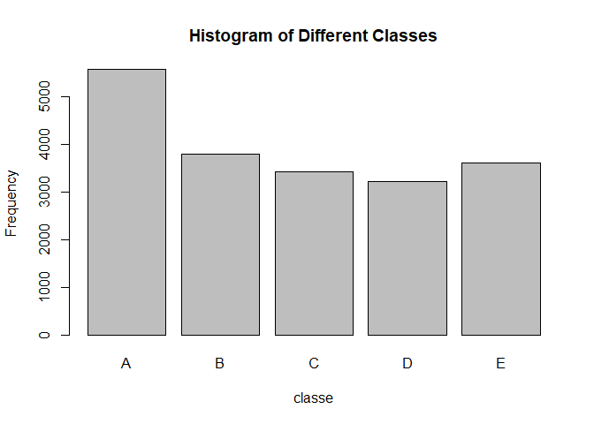
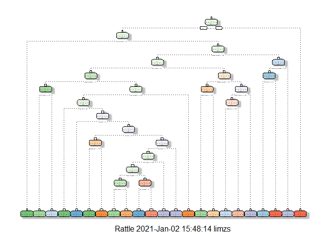

### Library and Seed Setting


```r
library(caret)
```

```
## Loading required package: lattice
```

```
## Loading required package: ggplot2
```

```r
library(randomForest)
```

```
## randomForest 4.6-14
```

```
## Type rfNews() to see new features/changes/bug fixes.
```

```
## 
## Attaching package: 'randomForest'
```

```
## The following object is masked from 'package:ggplot2':
## 
##     margin
```

```r
library(rpart)
library(rpart.plot)
library(rattle)
```

```
## Loading required package: tibble
```

```
## Loading required package: bitops
```

```
## Rattle: A free graphical interface for data science with R.
## Version 5.4.0 Copyright (c) 2006-2020 Togaware Pty Ltd.
## Type 'rattle()' to shake, rattle, and roll your data.
```

```
## 
## Attaching package: 'rattle'
```

```
## The following object is masked from 'package:randomForest':
## 
##     importance
```

```r
set.seed(1234)
```

### Data Processing and Exploratory Data Analysis

The relevant data are loaded, while irrelevant variables or missing values are removed.


```r
training <- read.csv(url("https://d396qusza40orc.cloudfront.net/predmachlearn/pml-training.csv"), na.strings=c("NA","#DIV/0!", ""))
testing <- read.csv(url("https://d396qusza40orc.cloudfront.net/predmachlearn/pml-testing.csv"), na.strings=c("NA","#DIV/0!", ""))

training$classe <- as.factor(training$classe)

training <- training[,-c(1:7)]
testing <- testing[,-c(1:7)]

training <- training[,colSums(is.na(training)) == 0]
testing <- testing[,colSums(is.na(testing)) == 0]
```

A histogram is then plotted in order to provide an overview of the training data, with the outcome variable `classe` on the x-axis.


```r
plot(training$classe, main = "Histogram of Different Classes", xlab = "classe", ylab = "Frequency")
```

<!-- -->

### Data Partitioning for Cross-Validation

Training data are then partitioned into training and testing samples in a 75-25 allocation.


```r
subSamples <- createDataPartition(training$classe, p = 0.75, list = FALSE)
subSampleTrain <- training[subSamples,]
subSampleTest <- training[-subSamples,]
```

### Cross-Validation and Model Selection

The accuracies of the decision tree and random forest algorithms will be compared to decide on the best model.

#### Decision Tree Model

The decision tree algorithm is first run on the training data.


```r
modDT <- rpart(classe ~ ., data = subSampleTrain, method = "class")

fancyRpartPlot(modDT)
```

```
## Warning: labs do not fit even at cex 0.15, there may be some overplotting
```

<!-- -->

We then carry out predictions on the testing data, before obtaining the accuracy of the predictions.


```r
predictDT <- predict(modDT, subSampleTest, type = "class")
confusionMatrix(predictDT, subSampleTest$classe)
```

```
## Confusion Matrix and Statistics
## 
##           Reference
## Prediction    A    B    C    D    E
##          A 1251  149   15   61   17
##          B   38  572   75   60   75
##          C   39  117  696  117  122
##          D   49   58   51  508   58
##          E   18   53   18   58  629
## 
## Overall Statistics
##                                           
##                Accuracy : 0.7455          
##                  95% CI : (0.7331, 0.7577)
##     No Information Rate : 0.2845          
##     P-Value [Acc > NIR] : < 2.2e-16       
##                                           
##                   Kappa : 0.6774          
##                                           
##  Mcnemar's Test P-Value : < 2.2e-16       
## 
## Statistics by Class:
## 
##                      Class: A Class: B Class: C Class: D Class: E
## Sensitivity            0.8968   0.6027   0.8140   0.6318   0.6981
## Specificity            0.9310   0.9373   0.9024   0.9473   0.9633
## Pos Pred Value         0.8379   0.6976   0.6379   0.7017   0.8106
## Neg Pred Value         0.9578   0.9077   0.9583   0.9292   0.9341
## Prevalence             0.2845   0.1935   0.1743   0.1639   0.1837
## Detection Rate         0.2551   0.1166   0.1419   0.1036   0.1283
## Detection Prevalence   0.3044   0.1672   0.2225   0.1476   0.1582
## Balanced Accuracy      0.9139   0.7700   0.8582   0.7896   0.8307
```

#### Random Forest Model

The random forest algorithm is first run on the training data.


```r
modRF <- randomForest(classe ~ ., data = subSampleTrain, method = "class")
```

We then carry out predictions on the testing data, before obtaining the accuracy of the predictions.


```r
predictRF <- predict(modRF, subSampleTest, type = "class")
confusionMatrix(predictRF, subSampleTest$classe)
```

```
## Confusion Matrix and Statistics
## 
##           Reference
## Prediction    A    B    C    D    E
##          A 1395    4    0    0    0
##          B    0  944    8    0    0
##          C    0    1  847    6    0
##          D    0    0    0  798    1
##          E    0    0    0    0  900
## 
## Overall Statistics
##                                           
##                Accuracy : 0.9959          
##                  95% CI : (0.9937, 0.9975)
##     No Information Rate : 0.2845          
##     P-Value [Acc > NIR] : < 2.2e-16       
##                                           
##                   Kappa : 0.9948          
##                                           
##  Mcnemar's Test P-Value : NA              
## 
## Statistics by Class:
## 
##                      Class: A Class: B Class: C Class: D Class: E
## Sensitivity            1.0000   0.9947   0.9906   0.9925   0.9989
## Specificity            0.9989   0.9980   0.9983   0.9998   1.0000
## Pos Pred Value         0.9971   0.9916   0.9918   0.9987   1.0000
## Neg Pred Value         1.0000   0.9987   0.9980   0.9985   0.9998
## Prevalence             0.2845   0.1935   0.1743   0.1639   0.1837
## Detection Rate         0.2845   0.1925   0.1727   0.1627   0.1835
## Detection Prevalence   0.2853   0.1941   0.1741   0.1629   0.1835
## Balanced Accuracy      0.9994   0.9964   0.9945   0.9961   0.9994
```

### Conclusion

The random forest model provided a much higher accuracy of 0.9963 compared to the decision tree model, which only had an accuracy of 0.7455. As such, the random forest model should be chosen. The expected out-of-sample error is estimated to be 0.37%. The model produces the following predictions for the original testing data.


```r
predict(modRF, testing, type = "class")
```

```
##  1  2  3  4  5  6  7  8  9 10 11 12 13 14 15 16 17 18 19 20 
##  B  A  B  A  A  E  D  B  A  A  B  C  B  A  E  E  A  B  B  B 
## Levels: A B C D E
```
